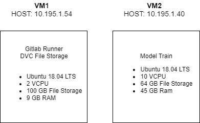

[](https://gitlab.lrz.de/adl-ai/practical-big-data-science-adl-ai/commits/master)

[](https://gitlab.lrz.de/adl-ai/practical-big-data-science-adl-ai/commits/master)

# Practical Big Data Science ADL-AI

## Project Organization
------------

    ├── LICENSE
    ├── Makefile           <- Makefile with commands like `make data` or `make train`
    ├── README.md          <- The top-level README for developers using this project.
    ├── data
    │   ├── processed      <- The final, canonical data sets for modeling.
    │   └── raw            <- The original, immutable data dump.
    │
    ├── docs               <- A default Sphinx project; see sphinx-doc.org for details
    │
    ├── models             <- Trained and serialized models, model predictions, or model summaries
    │
    ├── notebooks          <- Jupyter notebooks. Naming convention is a number (for ordering),
    │                         the creator's initials, and a short `-` delimited description, e.g.
    │                         `1.0-jqp-initial-data-exploration`.
    │
    ├── references         <- Data dictionaries, manuals, and all other explanatory materials.
    │
    ├── reports            <- Generated analysis as HTML, PDF, LaTeX, etc.
    │   └── figures        <- Generated graphics and figures to be used in reporting
    │
    ├── requirements.txt   <- The requirements file for reproducing the analysis environment, e.g.
    │                         generated with `pip freeze > requirements.txt`
    │
    ├── setup.py           <- makes project pip installable (pip install -e .) so src can be imported
    ├── src                <- Source code for use in this project.
    │   ├── __init__.py    <- Makes src a Python module
    │   │
    │   ├── data           <- Scripts to download or generate data
    │   │   └── make_dataset.py
    │   │
    │   ├── features       <- Scripts to turn raw data into features for modeling
    │   │   └── build_features.py
    │   │
    │   ├── models         <- Scripts to train models and then use trained models to make
    │   │   │                 predictions
    │   │   ├── predict_model.py
    │   │   └── train_model.py
    │   │
    │   └── visualization  <- Scripts to create exploratory and results oriented visualizations
    │       └── visualize.py
    │
    └── tox.ini            <- tox file with settings for running tox; see tox.testrun.org

--------

<p><small>Project based on the <a target="_blank" href="https://drivendata.github.io/cookiecutter-data-science/">cookiecutter data science project template</a>. #cookiecutterdatascience</small></p>


## Process (new) datasets
**1.** Add a new folder (named after the dataset) to the existing folder "practical-big-data-science-adl-ai/data/raw".  
   The new folder should contain the following files: train.txt, valid.txt and test.txt (each line contains entity1, relation, entity2 tab-separated)  
   
**2.** In the folder "practical-big-data-science-adl-ai/src/data" run the following: 
   ```
   $ python make_dataset.py ../../data/raw/<inputfolder> ../../data/processed/<outputfolder>
   ```
   The resulting datasets and dictionaries are saved using pickle.  
   If you want to run the given unittests you have to comment out line 225 (main())!  
   _**Tip:** It would be better if the unittests run on fake data (not on the full data set)_
   
   
**3.** Add results to DVC (see: [How to use DVC for data sets](https://gitlab.lrz.de/adl-ai/practical-big-data-science-adl-ai/wikis/How-to-use-DVC-for-data-sets)).  

The pickled train, valid and test datasets contain triples; every entity and every relation is represented by its unique id.  
If you want to transform an ID to the coresponding entity or relation, you can use the pickled dictionary in the following folder: "practical-big-data-science-adl-ai/data/processed/outputfolder".  
=======
# ADL-AI Link Prediction and Knowledge Graph Completion

Welcome to the ADL-AI project for link prediction. Our project aims to evaluate various Knowledge graph embedding models and use an ensemble model in order to maximize the individual strengths of each underlying model.

# Quick Start

## 1. Install the python dependencies using a Virtual Environment Manager
In order to manage the python dependencies you will need a virtual environment manager. You can use Anaconda, Pipenv or Virtualenv.

> Note: this project requires **Python 3.6** to work with pytorch

Use one of the commands below to install the requirements.
### Anaconda
```python
>>> conda install -f requirements.txt
```

### Pipenv
```python
>>> pipenv install -r requirements.txt 
>>> # Activate the pipenv environment
>>> pipenv shell
```

### Virtualenv
Depending on where your venv folder is located (typically project root!) you can activate the virtual environment by using:
```bash
>>> source ./venv/bin/actvate
>>> pip install -r requirements.txt
```

## 2. Pull and preprocess the training data using the DVC tool.
Make sure you have the key file to access the virtual machine as desribed above.

```python
>>> dvc remote modify --local <path-to-keyfile>
>>> dvc pull
>>> dvc repro preprocess.dvc
```

Configure your dvc instance to point to the key file on your local machine using the first command.
The second command retrieves the raw training data from the file server. Finally the last command runs a 
prerecorded preprocessing step to create the index vocabulary and id-map data sets. You can verify that by having a look at the **./data** folder. You should see a raw and a processed folder.

## 3. Connect to the virtual machine to train your model
The username for the virtual machine is ubuntu. The keyfile is the same one you are using for your dvc tool.

```bash
ssh -i <path-to-keyfile> ubuntu@10.195.1.40
```

The **-i** option specifies the location to the keyfile.

# Virtual machines
We set up two virtual machines on the LRZ Compute Cloud. On virtual machine hosts the gitlab runner and the dvc remote file server. The other virtual machine is meant for training the models. To connect to the virtual machine you will need a specific keyfile, please contact one of the project memebers if you absolutely require a keyfile. Figure 1 shows the details and host adress of each virtual machine. Please refer to [How connect to the Virtual Machine for Model Training](how-to-connect-to-vm) if you need furth details.



Two virtual machines. One for model training and one for the gitlab runner / dvc file server.
